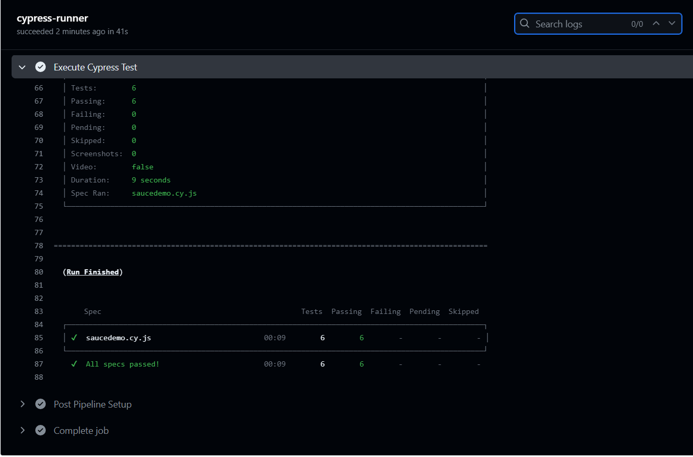

## Duplo Assessment

### Approach to Task
---

After a thorough test of the site, it was observed that the task contained repeated tasks which caused the approach as follows:

- [ ] Each Test requires a user to login and Logout 
- [ ] A `beforeEach` and `afterEach` hooks were created to handle the login and logout process
- [ ] For clarity, the login test was repeated as a sperate test.
- [ ] The core tests focused on the viewing a non-empty inventory, adding to and removing from cart, as well as checkout.

---

### Libraries Used
---

- [ ] [Cypress v. 13.9.0](https://www.npmjs.com/package/cypress)

- [ ] [Mochaawesome v.]()

---

### Set Guide
---

- [ ] Clone repository to a desired location on your machine
- [ ] Navigate to the repository and open terminal inside the repository
- [ ] Use `npm install` or `npm i` to install the dependencies required to run the test from the `package.json` file. Alternatively, you can use `npm ci` to install the dependencies required from the `package-lock.json` file

---

### Execute the Test
---

To excute the test headlessly, run the following

- [ ] To run without flags: `npx cypress run`
- [ ] To run with a specific browser: `npx cypress run --browser <specify a browser>`
> Cypress collects the binaries of browsers that are installed on your system in addition to the    default electron browser

---
### Bonus

---

A pipeline config was added to ensure that the test can run in a pipeline for every time there's push or merge to the main branch. Below is a screenshot of a sample result from the GitHub Actions execution.

---

### Contributor
---
[Segun Ayanloye]()
